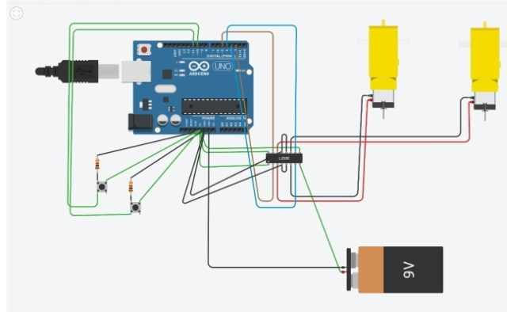
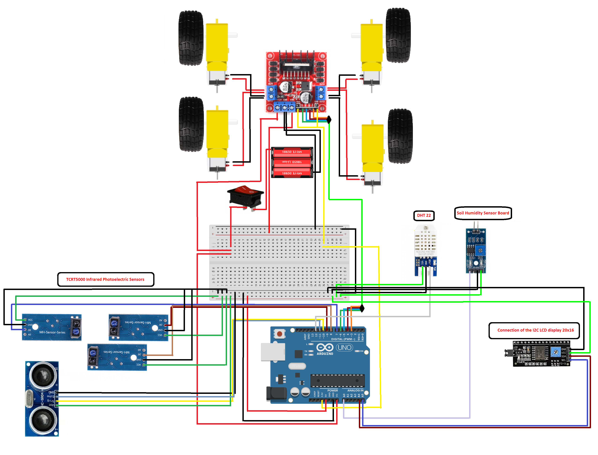

[Επιστροφή στη Κεντρική](../readme.md)

# Μελέτη κίνησης με χρήση Arduino

- Όπως γνωρίζουμε ο μικροελεγκτής Arduino μπορεί να στέλνει απο τις εξόδους της πλακέτας του σήμα αναλογικό ή ψηφιακό (Pulse With Modulation), δηλαδή μπορούν να λειτουργήσουν ώς θετικοί πόλοι μιας μπαταρίας εφόσον αναφερόμαστε στη συμβατική φορά μετακίνησης φορτίου. Επομένως όταν μία έξοδος συνδεθεί με έναν ακροδέκτη ενός μοτέρ (λειτουργίας συνεχούς ρεύματος DC) και ο άλλος ακροδέκτης συνδεθεί με τη γείωση έχουμε περιστροφή του μοτέρ προς μία κατεύθυνση. Για να επιτύχουμε κίνηση προς την αντίθετη κατεύθυνση θα πρέπει να αντιστρέψουμε τη πολικότητα κάτι το οποίο δέ μπορεί να κάνει μέχρι τώρα απο μόνο του το Arduino.

- Το πρόβλημα επιλύεται με την είσοδο της H-Bridge στην οποία μπορούμε να επιλέξουμε εμείς τη πολικότητα που εφαρμόζεται στα άκρα του μοτέρ κάθε χρονική στιγμή και η οποία εξαρτάται από το ζευγάρι καναλιών που ενεργοποιείται: S1/S4 ή S3/S2. Η Θεωρητική υλοποίηση ενός τέτοιου κυκλώματος L293D περιγράφεται στη παρακάτω εικόνα(εδώ θα δουλεύουν σαν HIGH Input λόγο 1-9 pins 5V )

- Ακολουθεί η Υλοποίηση ενός τέτοιου κυκλώματος στο TinkerCad με τη χρήση 2 κουμπιών που καθορίζουν τη φορά της κίνησης, για να μπορέσουμε να κατανοήσουμε τόσο τη συνδεσμολογία όσο και το τρόπο προγραμματισμού του Arduino. Παρατίθεται o σύνδεσμος στον οποίο μπορεί να τρέξει κάποιος την εξομοίωση και να δεί τον κώδικα, ακολουθεί μια εικόνα του κυκλώματος για γρήγορη αναφορά.(Χρειάζεται ένας δωρεάν λογαριασμός στο Tinkercad για να τρέξετε το Link).

## 
 [Σύνδεσμος Υλοποίησης σε Tinkercad](https://www.tinkercad.com/embed/g3JbT8yw19p)

  

- Μία τέτοια απλή κατασκευή που τροφοδοτείται απο powerbank, έχει 2 μοτέρ κίνησης που κινούνται ταυτόχρονα προς μία φορά, έναν αισθητήρα απόστασης για να μπορεί σε πιθανή ανίχνευση εμπρόσθιου εμποδίου να αλλάζει κατεύθυνση κινούμενη προς τα πίσω, παρουσιάστηκε στο ΔΙΕΚ πάτρας το Δεκέμβρη 2019 (Υλικά&Κατασκευή Πόθος Ιωάννης).

## 
 [Βίντεο παρουσίασης πρώτης πλατφόρμας κίνησης](https://www.facebook.com/watch/?v=739530876530282) 

  

    

## 
 <strong> Version 2 </strong> 

#### Το επόμενο βήμα ήταν η συναρμολόγηση πλατφόρμας με περισσότερες δυνατότητες, η οποία εκτός απο τα "Βασικά" θα μπορούσε να κινηθεί σε διαδρομή που ορίζεται απο πλευρικά εμπόδια:

- θα μπορούσε να ελέγξει για εμπόδια αριστερά και δεξιά και θα αποφάσιζε προς τα που θα κινηθεί. Επομένως ενεργοποιώντας μόνο το ένα μοτέρ θα περιστρεφόταν προς τη μία κατεύθυνση, θα έπαιρνε τη πρώτη μέτρηση, μετά με ενεργοποίηση του άλλου(για διπλάσιο χρόνο) πηγαίνει στην αντίθετη κατεύθυνση για τη δεύτερη μέτρηση και τέλος επαναφορά στην αρχική θέση. 
    - Σε αυτό το σημείο το arduino θα έκανε σύγκριση των (2) μετρήσεων και θα επέλεγε τη "μεγαλύτερη ελεύθερη" διαδρομή ( ή θα έκανε αναστροφή 180μοιρών εφόσον και οι άλλες 2 μετρήσεις ανίχνευαν εμπόδιο σε κοντινή απόσταση).
- Προσθήκη laser για ευκρινέστερη κατάδειξη της περιοχής ελέγχου των υπερήχων.
- Προσθήκη 10mm Red led και beeper και αλλαγή κώδικα, ώστε το αμάξι με την ανίχνευση εμποδίου, να προσπαθεί να ελέγξει εάν είναι προσωρινό (πχ ζώο) η μόνιμο εμπόδιο (με παραγωγή σημάτων φωτός και ήχου) και σε περίπτωση που δε φεύγει για 2.5sec να ψάχνει για εναλλακτική διαδρομή.
- Κατάργηση PowerBank(λόγω βάρους) με σύνδεση 4Χ1.2V μπαταριών σε σειρά στο 15V pin του circuit και τροφοδοσία του Arduino μέσω αυτού.
- Προσθήκη LCD οθόνης όπου κάθε στιγμή περιγράφεται η διαδικασία που ακολουθεί η κατασκευή.

Η πλατφόρμα αυτή παρουσιάστηκε στη Χριστουγεννιάτικη εκδήλωση του ΔΙΕΚ Πάτρας(Σύνδεσμος στη πρώτη σελίδα και Ειδικότερα η λειτουργία της φαίνεται στο παρακάτω βίντεο)

## 
 [Βίντεο: Αποφυγή εμποδίων απο Arduino Car v2 ](https://www.youtube.com/watch?v=sYD2LIY47uA) 

  

<a href="CarV2.txt"><b>
Πατήστε για εμφάνιση του κώδικα της Έκδοσης 2.0
</b></a> 

## 
 <strong> Παρατηρήσεις: </strong> 

    1.	Οι 4 μπαταρίες 1.2v(rechargeable) και 1Χ9V για τροφοδοσία arduino οριακά κινούν τη κατασκευή σε χαλί οπότε χρειάζεται βελτίωση τροφοδοσίας. Οι μπαταρίες θα πρέπει να αντικατασταθούν με πιο δυνατές οπότε καταλήγουμε σε συστοιχίες των 18650 οι οποίες εκτός από επαναφορτιζόμενες είναι και πιο δυνατές 3.6V έκαστη σε πλήρη φόρτιση.
    2.	Τα 2 DC motor δεν είναι επαρκή για βαρύτερες κατασκευές και κρίνεται αναγκαία η παρουσία 2 ακόμα motors  οπότε θα καταλήξουμε σε 4WD ή ανώτερη πλατφόρμα.
    3.	Η οθόνη LCD 2x16 δεν επαρκεί για πλήρη παρουσίαση των δεδομένων και ενεργειών που δέχεται και εκτελεί κάθε στιγμή το Arduino οπότε αναβαθμίζουμε σε LCD 4Χ16.
    4.	Ο L293D ενώ έχει μικρές απώλειες δέχεται τροφοδοσία μόνο σε 1 pin και υπερθερμαίνεται εύκολα οπότε σε μεγαλύτερες κατασκευές/περισσότερα μοτέρ πρέπει να πάμε στον L298N ο οποίος έχει καλύτερο σύστημα ψύξης και μικρή απώλεια -2V.

- Παρουσιάζεται η συνδεσμολογία που χρησιμοποιήθηκε με L293D, τονίζοντας πως<u> αναπτύσσονται σχετικά εύκολα υψηλές θερμοκρασίες ακόμα και με τη παρουσία Headers οπότε θα ακολουθήσει κατασκευή σε L298N που ενώ έχει μικρή πτώση τάσης ~2V διαθέτει καλύτερο σύστημα ψύξης</u> και δυνατότητα παροχής τροφοδοσίας 5V στο υπόλοιπο κύκλωμα εφόσον η τάση που το τροφοδοτούμε δέ ξεπεράσει τα 12V.

  

    

## 
 <strong> Version 3 </strong> 

Επανασχεδιασμός της κατασκευής με χρήση L298N και 4WD πλατφόρμας

- 
Σε ένα τέτοιο σύστημα τα καλώδια που θα χρειαστεί να συνδέσουμε είναι σαφώς λιγότερα, "κουμπώνουν" με βίδες πάνω στη πλακέτα οπότε δέν έχουμε εύκολα αποκολλήσεις και πλέον μπορούμε να χρησιμοποιήσουμε ακόμα πιο ισχυρές επαναφορτιζόμενες μπαταρίες (τις 18650 των 3,6V).

- 
Ένα επιπλέον προτέρημα είναι ότι πλέον έχουμε αρκετή ισχύ να τοποθετήσουμε 4 DC motors κάνοντας το όχημα 4WD δίνοντάς του μεγάλη αυτονομία και ελευθερία στη κίνηση.

 

  

- 
Πιο δυνατές μπαταρίες σημαίνει περισσότερο ωφέλιμο φορτίο οπότε αναβαθμίστηκε η κατασκευή πηγαίνοντας σε όχημα με επιπλέον όροφο το οποίο μας επιτρέπει και καλύτερη διαχείρηση χώρου.

  
 

  

### Έχουμε την έκδοση v3.0 η οποία μας αφήνει αρκετό χώρο να τοποθετήσουμε το βραχίονα, η οθόνη αναβαθμίστηκε απο 2Χ16 σε 4Χ16, οι μπαταρίες απο AA(4 X 1.2V) σε 18650(3 X 3.6V),τα μοτέρ κίνησης αυξήθηκαν απο 2 σε 4 και έχουμε έναν επιπλέον όροφο χωρίς να θυσιάζουμε την ισορροπία καθώς διατηρήσαμε το κέντρο βάρους χαμηλά.
 

  

## 
 <strong> Παρατηρήσεις: </strong> 

     Η κατασκευή έχει πλέον :
    - Ενεργειακή επάρκεια και μπορούν να προστεθούν επιπλέον κυκλώματα.
    - Καλύτερη Ισορροπία λόγο χαμηλού κέντρου βάρους. 
    - Πραγματική Τετρακίνηση , χωρίς περιορισμούς σε "εργαστηριακή" διαδρομή.
    - Ακρίβεια στις κινήσεις , οπότε μπορεί να εφαρμοστεί Line Follower.
    
### Επόμενο βήμα είναι να αναβαθμιστεί ο κώδικας ώστε να έχουμε Line - Follower Δυνατότητα και η κατασκευή μας να σταματάει σε συγκεκριμένα σημεία για μετρήσεις(στο πείραμα σταματάει στο πρώτο εμπόδιο.)

  

## 
 <strong> Version 4 </strong> 

## O Line Follower που θα προσαρμόσουμε αποτελείται απο:

- (3) αισθητήρες TCRT5000 Infrared Photoelectric Sensor - Line Track 
    - Kάθε ένας απο τους οποίους θα ανιχνεύει το μαύρο χρώμα μια μονωτικής ταινίας που θα χρησιμοποιήσουμε στο παράδειγμα. 
    - Αναλόγως με τους συνδιασμούς σημάτων που θα φτάνουν στο Arduino απο αυτούς τους αισθητήρες θα καταλαβαίνει τη "θέση" της πλατφόρμας και το πώς πρέπει να κινηθεί για να είναι σε συμφωνία με τη γραμμή οδηγό.
- Μία επιφάνεια η οποία θα έχει εγκοπές, ώστε το κάτω μέρος του αισθητήρα να περνάει μέσα απο αυτές και να  εφάπτεται σχεδόν με το έδαφος, για να έχουμε τη καλύτερη δυνατή μέτρηση. Το υπόλοιπο μέρος του αισθητήρα TCRT5000 θα βρίσκεται πάνω απο την επιφάνεια για προστασία.
    - Ο μεσαίος αισθητήρας θα είναι συνεχώς πάνω στη γραμμή, ενώ θα πρέπει να προσαρμόσουμε τους άλλους 2 ώστε να είναι οριακά στο πάχος της γραμμής οδηγού που θα χρησιμοποιήσουμε(δηλαδή η γραμμή υπάρχει μεταξύ τους).

    
  

    - Λόγο του αυξημένου αριθμού καλωδίων, κρίνεται απαραίτητη η εισαγωγή breadboard στo κάτω όροφο της κατασκευής για να είναι προστατευμένα και οργανωμένα.
        
    
  

    - Επιπλέον είναι η κατάλληλη στιγμή να εισέλθει στο πρότυπο μας on-off switch, ο οποίος με τη βοήθεια του breadboard θα μας εξασφαλίσει την ομαλή "τοπική" βελτιστοποίηση των μερών του συστήματος. 
    
    
 

    
  

    
- Η κατασκευή μας είναι έτοιμη για δοκιμές και τί καλύτερο απο μια "μή ευθεία" διαδρομή, βάση της οποίας θα γίνουν και οι βελτιστοποιήσεις στους χρόνους κίνησης "steps"
 - Πειραματικά, έχουμε δώσει και τη δυνατότητα στο arduino να μετράει τον αριθμό των steps που πραγματοποιούνται στη διαδρομή(έμμεση μέτρηση απόστασης) καθώς και πόσες φορές χρειάστηκε αριστερόστροφη/δεξιόστροφη διόρθωση πορείας.
- Για οδηγό θα χρησιμοποιήσουμε μαύρη μονωτική ταινία.

    
  

- Εφόσον έχουμε προγραμματίσει τη πλατφόρμα μας να ακολουθεί τη διαδρομή με επιτυχία και να μπορεί να επιτελέσει 180 μοίρες αναστροφή στο τέλος(και να γυρίζει στην αρχή), είναι η ώρα να προσαρμόσουμε τους αισθητήρες Θερμοκρασίας, Υγρασίας Ατμόσφαιρας &  Εδάφους.
- Το arduino θα παίρνει μετρήσεις όταν φτάσει στο τέλος ( εκεί που έχομε βάλει το εμπόδιο) της διαδρομής και θα τις παρουσιάζει όταν τελειώνει τη περιοδεία του και επιστρέφει στην αρχή.
- Μετά απο τη παρουσίαση των δεδομένων που συνέλεξε θα αναφέρει στην οθόνη του για το εάν χρειάζεται να ξεκινήσει υδρονέφωση(για προστασία απο παγετό) ή πότισμα λόγο μεγάλης ξηρασίας.

## <b> [Βίντεο Παρουσίασης Διαδρομής και Εμφάνισης Μετρήσεων](https://www.youtube.com/watch?v=kW62gEEUloU)

## <a href="CarV4.txt" target ="_blank"><b>
Πατήστε για εμφάνιση του κώδικα της Έκδοσης 4.0
</b></a> 

  

  

## 
 <strong> Version 5 </strong> 

- Επόμενο βήμα είναι η προσθήκη βραχίονα, ο οποίος θα φέρει πάνω του τον Soil Humidity Sensor και θα τον εισάγει στο έδαφος για να έχουμε καλύτερα αποτελέσματα υγρασίας εδάφους και όχι επιφανειακά.

